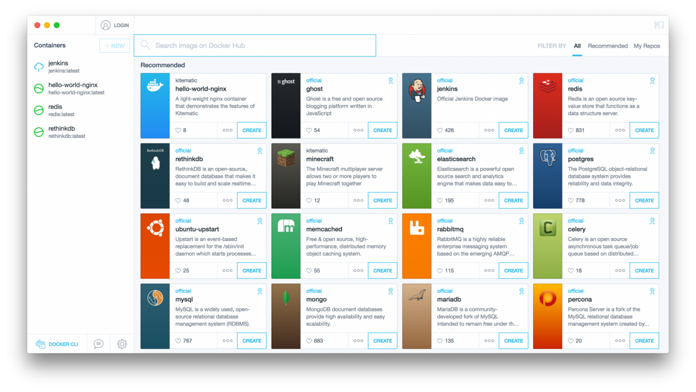

# Docker GUIs for Linux (ripoff)

## Table of contents
```
1. What is Docker and What to use it for
2. Why using a Graphical Interface
3. Some Options
   - Kitematic
   - DockStation
   - Portainer
4. Conclusion
```
## What is Docker
> lorem  
> ipsum
## Why using a Graphical Interface

- 
## Some Optioins  

### Kitematic
> lorem  
> ipsum  



### Dockstation
> lorem  
> ipsum  


### Portainer
> lorem  
> ipsum    


## Conclusion

|GUI            |Pros   |Cons   |
|---            |:---:  |---:   |
|**Kitematic**  |2      |3      |
|**DockStation**|       ||
|**Portainer**  |<ul style="text-align: left;"><li>Web-based - simple setup (it runs in a container)</li><li>Easy to navigate</li><li>User management</ul>|test|

## Sources
- [my only source of information](https://www.linuxjournal.com/content/search-gui-docker)